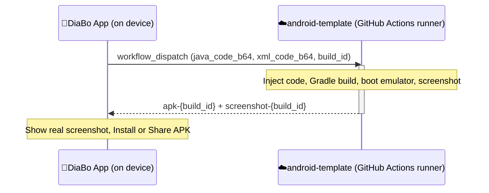

# DiaBo Preview Template

[](https://github.com/ShTanzir/android-template/actions/workflows/diabo-preview-build.yml)
[](LICENSE)

**Repository:** [github.com/ShTanzir/android-template](https://github.com/ShTanzir/android-template)

This repository is the **cloud build target** for [DiaBo](https://github.com/ShTanzir/DiaBo)'s "▶ Real Build" feature. It is not an app you run directly — it's a minimal, purpose-built Android project that GitHub Actions compiles on demand, producing a real APK and an emulator screenshot for whatever Java + XML code a DiaBo user is currently editing.

---

## Table of Contents

- [How It Fits Into DiaBo](#how-it-fits-into-diabo)
- [Repository Structure](#repository-structure)
- [The Build Pipeline](#the-build-pipeline)
- [Setup](#setup)
- [Security Model](#security-model)
- [Local Development](#local-development)
- [Limitations](#limitations)
- [License](#license)

---

## How It Fits Into DiaBo

DiaBo is a native Android IDE that lets you write Java and XML directly on your phone. Its **Instant Preview** feature renders layouts approximately, on-device, with no compilation. Its **Real Build** feature goes further — it produces a 100%-accurate, real Android build. That accuracy requires an actual Gradle build and a real emulator, which isn't practical to run on a phone. This repository is where that work happens instead.




1. A DiaBo user opens a project's `.java` and `.xml` tabs and taps **▶ Real Build**.
2. DiaBo base64-encodes both files and calls GitHub's REST API to dispatch
   [`diabo-preview-build.yml`](.github/workflows/diabo-preview-build.yml) in *this* repo, passing the code as workflow inputs along with a unique `build_id`.
3. The workflow injects that code into this project, runs `./gradlew assembleDebug`, boots an emulator, installs the APK, and captures a screenshot.
4. DiaBo polls the GitHub Actions API for the matching run, then downloads the resulting `apk-{build_id}` and `screenshot-{build_id}` artifacts.
5. The user sees the real screenshot in-app and can install the APK directly, or share it.

---

## Repository Structure

android-template/
├── .github/
│   └── workflows/
│       └── diabo-preview-build.yml     ← Main GitHub Actions pipeline (core file)
├── app/
│   ├── build.gradle                     ← App module dependencies
│   └── src/main/
│       ├── AndroidManifest.xml
│       ├── java/com/diabo/preview/
│       │   └── MainActivity.java        ← Seed file (auto-overwritten every build)
│       └── res/layout/
│           └── activity_main.xml        ← Seed file (auto-overwritten every build)
├── gradle/
│   └── wrapper/
│       ├── gradle-wrapper.jar
│       └── gradle-wrapper.properties
├── build.gradle                          ← Root project config
├── settings.gradle
├── gradlew                                ← chmod +x already set
├── gradlew.bat
└── README.md


Only two files are ever touched by user-submitted code:
`app/src/main/java/com/diabo/preview/MainActivity.java` and
`app/src/main/res/layout/activity_main.xml`. Everything else in the repository is static.

---

## The Build Pipeline

[`diabo-preview-build.yml`](.github/workflows/diabo-preview-build.yml) runs on `workflow_dispatch` with three inputs:

| Input | Description |
|---|---|
| `java_code_b64` | Base64-encoded contents of `MainActivity.java` |
| `xml_code_b64` | Base64-encoded contents of `activity_main.xml` |
| `build_id` | A unique identifier generated by DiaBo, used to name output artifacts |

**Pipeline steps:**

1. Checkout this repository
2. Set up JDK 17
3. Decode and inject the submitted code, with a **200KB size guard** on each file
4. `./gradlew assembleDebug`
5. Upload the resulting APK as `apk-{build_id}`
6. Upload build logs as `log-{build_id}` (uploaded even if the build fails, for debugging)
7. Boot an Android emulator (API 30, x86_64), install the APK, launch it, and capture a screenshot
8. Upload the screenshot as `screenshot-{build_id}`

The job has a **12-minute timeout** and runs under a `concurrency` group keyed by `build_id`, so a stuck job can't silently consume runner minutes indefinitely or race against a retry of itself.

---

## Setup

To use this as your own Real Build backend for DiaBo:

### 1. Fork or use this repository directly

If you're the maintainer, this repo is already wired up — no changes needed to use it as-is.

### 2. Generate a GitHub Personal Access Token

Create a **fine-grained** token scoped to this repository only, with:

- **Actions:** Read and write
- **Contents:** Read

Avoid classic tokens with broader scopes than necessary — this token only needs to dispatch workflows and download artifacts here.

### 3. Configure DiaBo

In the DiaBo app, go to **Settings → GitHub Integration** and enter:

| Field | Value |
|---|---|
| Personal Access Token | *(the token from step 2)* |
| Owner | `ShTanzir` |
| Repo | `android-template` |
| Branch | `main` |
| Workflow file | `diabo-preview-build.yml` |

Tap **Save**, then open a project in DiaBo and tap **▶ Real Build**.

---

## Security Model

This repository accepts arbitrary Java and XML from anyone with a configured token, so it's built with a few deliberate constraints:

- **Narrow injection surface** — only `MainActivity.java` and `activity_main.xml` are ever written to; the workflow has no path to modify anything else in the repo.
- **Size-limited** — submissions over 200KB per file are rejected before Gradle ever runs.
- **Time-boxed** — every job hard-stops at 12 minutes.
- **No secrets in the injected-code path** — the workflow never exposes repository secrets to the build steps that touch user-submitted code.
- **Debug builds only** — this pipeline only ever produces unsigned debug APKs. It has no release-signing configuration, so there's nothing sensitive to leak even in a worst-case build script escape.

If you're deploying this for multi-user use rather than personal use, review [DiaBo's `PHASE5_HARDENING.md`](https://github.com/ShTanzir/DiaBo/blob/main/PHASE5_HARDENING.md) for a documented note on the current run-matching heuristic's limits under concurrent load.

---

## Local Development

You can build this project directly, outside of the DiaBo-triggered flow, to sanity-check changes to the template itself:

```bash
git clone https://github.com/ShTanzir/android-template.git
cd android-template
./gradlew assembleDebug
```

The resulting APK will be at `app/build/outputs/apk/debug/app-debug.apk`, running whatever is currently committed in `MainActivity.java` / `activity_main.xml`.

---

## Limitations

- **Debug builds only** — no release/signing pipeline is configured, by design.
- **Single-run-per-window matching** — DiaBo correlates a `build_id` to a GitHub Actions run using a time-window heuristic, since GitHub's dispatch API doesn't return a run ID synchronously. Two builds dispatched within a few seconds of each other could theoretically cross-match. Low risk for single-user use of this repo; worth hardening further before sharing one instance across many concurrent users.
- **Fixed dependency set** — `app/build.gradle` includes AppCompat, Material Components, ConstraintLayout, CardView, and RecyclerView. Code relying on other libraries won't build here without extending this file.
- **Emulator boot time** — most of a build's ~2–5 minute duration is emulator startup, not compilation.

---

## License

MIT — see [LICENSE](LICENSE).

## Related

- **[DiaBo](https://github.com/ShTanzir/DiaBo)** — the main IDE app this repository serves.
